# Kiosk Assistant
  

KioskAssistant is a UI tool that facilitates the creation Kiosk environments. Its purpose is to speed up the configuration of XML files by providing a graphical interface as well as prevent any mistakes by employing thorough checks and automatic XML Formatting.

## Requirements

- [.NET Desktop Runtime 7](https://dotnet.microsoft.com/en-us/download/dotnet/thank-you/runtime-desktop-7.0.4-windows-x64-installer)

## Capabilities

- Create Multi-App XML configurations
- Create SingleApp Kiosk XML configuration (KioskModeApp / ShellLauncher)
- Create Edge Browser kiosks using pre-defined templates

## How to use

The interfaces for MultiApp/KioskModeApp and ShellLauncher are similar and can mainly be broken down in two parts:

1. The profile panel - this contains a list of users/groups that a kiosk profile can be assigned to.
	
	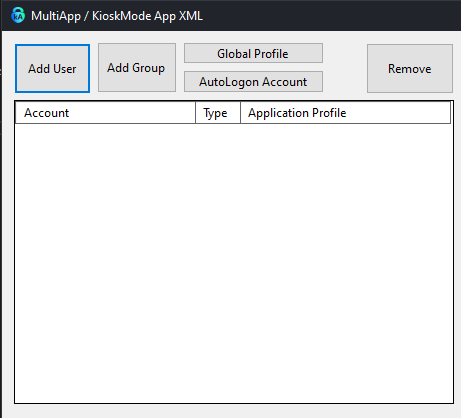

2. The application profile / custom shell panel - this contains the actual kiosk profile configurations that define the allowed app(s), icons, start menu layout, etc...

	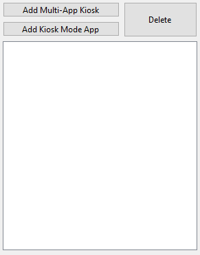

To generate an XML configuration, you need:

- At least 1 user/group
- At least 1 application profile
- All added users/groups need to have an application profile assigned to them. This can be done by selecting the user/group and the application profile and using the <> button:

	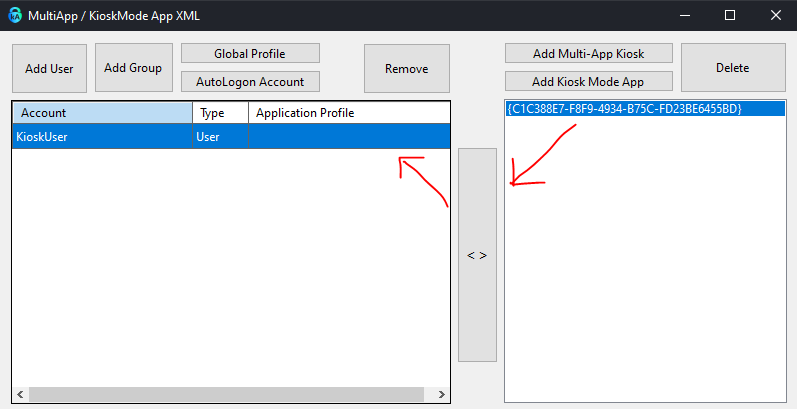

Once all conditions are met, the "Generate XML Button" will be available.

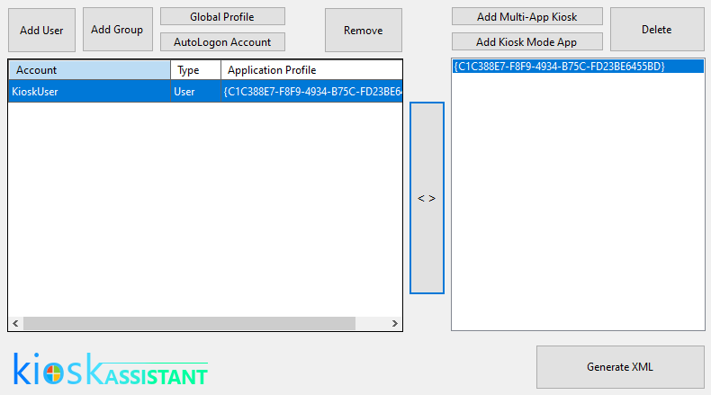

### Multi-App Kiosk Profile

The multi-app profile window contains several views and options. They can be mainly split into:

#### UWP Aplications

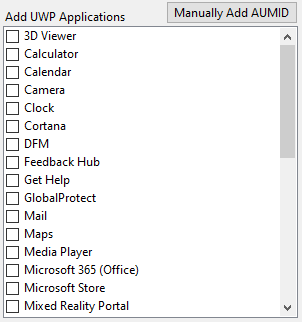

 A checkbox list comprised of all the modern apps found on the system where KioskAssistant runs. They can be added to the AllowedApps node of the XML simply by being checked. 

 If a required app is not found on the system, the AUMID can be manually typed in using the respective button.

#### Win32 Applications

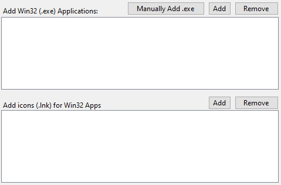

Classic applications can be added to the AllowedApps node by pointing to an executable file. This can either be selected from a File Dialog directly from the local system, or be typed in manually using the button.

Unlike UWP Applications, Win32 application require a .lnk file (shortcut) in order to be displayed on the Start Menu. Link files are optional, but not providing them will only add the app to the AllowedApps list without showing it on the Start Menu.

In the case of .exe and .lnk files added from the File Dialog, the application is very strict - it will verify whether the shortcut corresponds to any of the added executable files and will not add any stray links. This is to ensure the resulting Kiosk display does not contain any missing entries. 

#### Start Groups

The profile can only be saved once at least one Start Group has been defined. This can be done using the "Add and Configure App Group" button, which will open a new view:

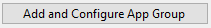

The panel on the left will contain a list of all the applications that have been added so far (checked UWP apps and added .EXE + .LNK pairs)

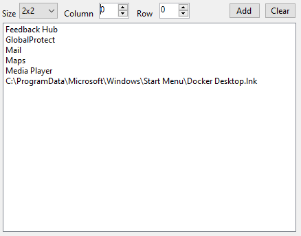

The size and position of each tile can be managed with the controls above. Once an entry has been selected and added, the Preview pane on the right will show its position and sizing inside the Start Menu group.

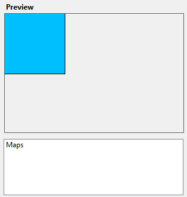

This will give you an overview of how the Group will look. 

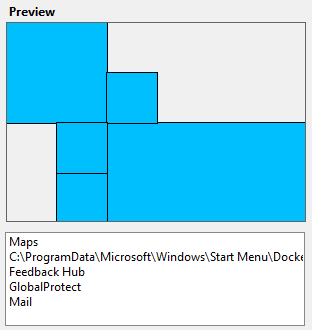

The application will not allow any tiles to be placed out of bounds or on already occupied space. Any misplacement will result in an error.

##### Remarks

- You cannot undo a single tile placement, but you can clear the whole board and start over with the "Clear" button
- Not all apps in the list have to be added to a single group - you can create multiple Start Menu groups (names cannot be duplicate) or just leave applications groupless (they will not be displayed in the start menu)
- Once a group has been created, the added apps will be removed from the lists and can be viewed in the lower panel. Groups cannot be modified, but they can be deleted, which will restore all included apps to their original lists.

	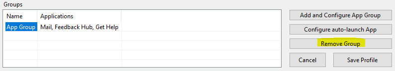

#### Auto-Launch Application
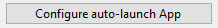

A single application can optionally be configured for auto-launch in a multi-app profile. This can be selected from a list of all applications added so far (whether they are in start groups or not). Removing the application from the AllowedApps will automatically remove it from the Auto-Launch config.

Other settings, as well as the target OS can be configured from the upper display of the profile. You can configure a single profile for both Win10 and Win11 simultaneously, but the Start Groups will be handled differently.

### Kiosk Mode App

A single application Kiosk Profile that can be configured and assigned from the same window as a multi app kiosk. An XML Configuration can contain both multi-app and kiosk mode app profiles, as long as they are assigned to different users/groups.

There are 3 templates for Kiosk Mode App:

- Edge (most common use case): This will pre-set the executable path and allow for the configuration of the URL, idle timeout and signage mode
- UWP: Will provide a list of locally installed modern apps for selection - the AUMID can also be manually typed in
- Win32 (unstable): Allows for the selection or manually input of an executable file and additional arguments; not guaranteed to work. 

### Shell Launcher

A single application Kiosk Profile similar to Kiosk Mode App. It cannot be configured in the same XML as a multi-app kiosk and therefore has its own menu.

App types are identical to Kiosk Mode App, however ShellLauncher differs in the accounts it can be assigned to. These can be either Names or SIDs of local or AD users and groups, or an Auto Logon Account.

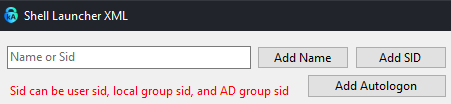

To add a profile, enter the name or sid in the text box and click the corresponding button - adding a name and clicking the Add SID button and vice-versa will result in a misconfiguration

### Profile assignment

Both Multi-App/KioskModeApp and ShellLauncher profiles will have a random, unique GUID. An XML Can have mutlipe profiles and assignments that can be configured from the main view.

You can assign a profile to multiple users at once by selecting the users on the left, the profile on the right, and clicking the <> button

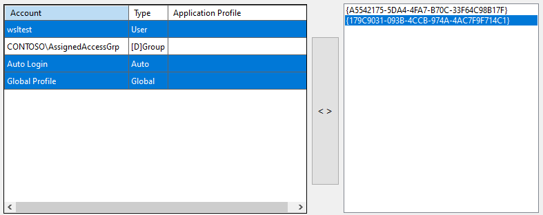

Profiles already assigned to a user/group can be overwritten by another profile if needed.

